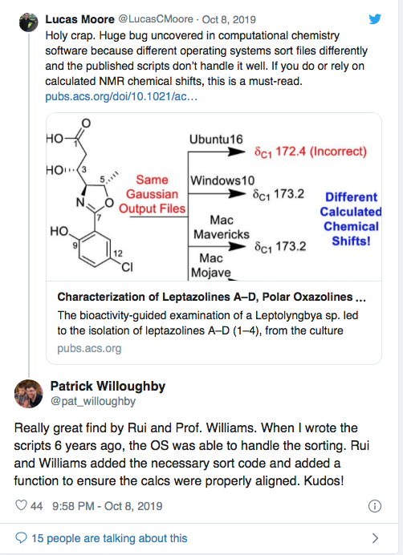

# http://bit.ly/ase-coderefinery-2019
---
layout: true
class: middle, inverse

---

# Fail Forward: Development of Reproducible and Reusable software is a learning experience

## Bjørn Lindi and [Radovan Bast](http://bast.fr)

### [NeIC](https://neic.nordforsk.org)/ [NTNU](https://www.ntnu.no) & [NeIC](https://neic.nordforsk.org)/ [UiT The Arctic University of Norway](https://uit.no)

Text is free to share and remix under [CC-BY-4.0](https://creativecommons.org/licenses/by/4.0/).

Credits: [Jonas Juselius](https://github.com/juselius),
[Roberto Di Remigio](http://totaltrash.xyz),
[Ole Martin Bjørndalen](https://github.com/olemb)

???
- Work at the HPC-group@NTNU (since 2004).
- Participate in the CodeRefinery.
- Do HPC support, coderefinery workshops, project management (NLPL)
---
# Fail forward?

--
## Give yourself the freedom to make mistakes, establish short feed back cycles.

???
- Short feedback cycles. This high addictive game has a short feedback
  cycle. 
- This how our development environment should be - playground.
- This essential for our learning experience.

---
# Reproducibility?
--

## [Doubt about 150 published chemistry studies](https://arstechnica.com/information-technology/2019/10/chemists-discover-cross-platform-python-scripts-not-so-cross-platform/)

???
- What is the state software you wrote 6 years ago or more?
- ...reproducibility can be needed on any rainy monday, support example:
- "It work a month a go. Something has changed! I don't think I have large-file-support
- 4-6 weeks to sort out what the problem really was. 

---
# Reusable?
--

## The bush versus the tree

???

- Witness development cycles like a bush not as a three.
- Cycle-time is close a PhD-thesis.
- Loss of a very precious resource - time
- Someone comes after us - could be our future self!

---

# Write tests first!

???
- We need testable code! (We = you, me, the world)
- Tests are specification; they define behavior.
- You are trained to work like this:
  - as a scientist you make a hypothesis.
  - next you need verify it, which often takes a little more effort than expected.

--

.. but I know what I am doing, why should I write tests first?

???
- You are starting from an outside-in perspective. How will this be
  used?
- Write just enough tests to specify the behaviors you're building and
   only write code to make failing test pass.

---

# What you "know" is a mix of...

* True knowledge
* A set of assumptions 
  
???
 - Which of your believes are wrong?
--

## Some of the assumptions are wrong.
A test written first can reveal this.

???
- Since you have to think thoroughly about have to write a test testing a  new behavior, already the thought process may reveal wrong assumptions.
---
# Implementing a feedback cycle
* By writing tests first you implement a feedback cycle. 
* Writing tests specifying behavior, you create a active environment which relates to your code.
* If behavior is broken, it shows up immediately.

???
- Tests are the holes in the Brio labyrinth.
- Your stating a hypothesis - next you prove it is right.

---
# Test-first development
* It is a design methodology
* "It helps developers build high quality code by forcing them to write
  testable code and by concretizing requirements" --David Scott
  Bernstein [1]

???
We are not talking QA here...
- Emphasize testing behavior - not edge cases.
- Thinking about QA-cases is a separate task.
- TDD is  ping-pong between the outside-in view, where you write the
  test, and the inside-out view, where write code meeting the
  requirement the test represents.
- You are used to making hypothesis as a part of your scientific
  training. This is nothing new.
- Once the test passes, the tests serves as confirmation of behavior. If
  the tests breaks, some intend behavior is absent.
  
---

# Learn Test-Driven Development

???

1. Write a test. Think about how you would like the operation in your
   mind to appear in your code. You are writing a story. Invent the
   interface you wish you had. Include all of the elements in the story
   that you imagine will be necessary to calculate the right answers.
--Kent Beck, TDD by Example

---
# Starting on red.

* Focus on one test at a time, and implement the new behavior step by
  step - with short feedback cycles.
* Name the test properly - it is the test of a new
  behavior/feature.
  
???
"Take great care with naming. The small investment of deriving highly
descriptive test names pays well over time, as tests are read and reread
by others who must maintain the code. Crafting a good test name will
also help you, the test writer, better understand the intent of what
you're about to build.

You'll be writing a number of tests for each behavior in the system.
Think about the set of test names as a concordance that quickly provides
a developer with a concise summary of that behavior. The easier the test
names are to digest, the more quickly you and other developers will find
what you seek."
--Jeff Langr, Modern C++ Programming with Test-Driven Development

---
# Getting to green.

* We only write as much code as needed to pass the test. If implies copy
  code, we copy code. If mean using constants, we use constants. 
  
* First we solve "that works" part of the problem. Then we solve the
  "clean code" part(that is part of the next step - refactoring). Divide et imperia.
  
???

"Make it run. Quickly getting that bar to green dominates everything
else. If a clean, simple solution is obvious, then type it in. If the
clean, simple solution is obvious but it will take you a minute, then
make a note of it and get back to the main problem, which is getting
the bar green in seconds. This shift in aesthetics is hard for some
 experienced software engineers. Quick green excuses all sins. But
only for a moment."
--Kent Beck, TDD by Example

---
## Refactor - incorporate the learning experience from satisfying the test 
* To get passed the test, you did some sins. Now you make it right.
* Get rid of duplication.
* Let the code express your learning from the outside-in/inside out
  ping-pong.
* Make the code readable and understandable. 
* Tidy up and make the code CLEAN.

???

Refactoring is defined by Martin Fowler as a:
- disciplined technique for restructuring an existing body of code,
  altering is internal structure without changing its external behavior. 
  
"Make it right. Now that the system is behaving, put the sinful ways
   of the recent past behind you. Step back onto the straight and narrow
   path of software righteousness. Remove the duplication that you have
   introduced , and get to green quickly."
-- Kent Beck, TDD by Example
   
---
# Start over again, add new functionality

???
- You are incrementally verifying and building new behavior in this way
- You are establishing a development path with feedback.
- You also train/exercise the ability to vary the "step size".
- Being able to vary the step size is valuable when things become brittle
 (your on thin ice.)
 
---
# What is CLEAN code?

--

* It is Cohesive.
* It is Loosely coupled.
* It is Encapsulated.
* It is Assertive.
* It is Non-redundant

This is taken from [1].

???
* Cohesive code reduce side effects
* Loosely coupled code is easier to test
* Encapsulated code is easier to extend
* Assertive code makes software more modular
* Non-redundant code reduces maintenance issues

---
# Quality Code is Cohesive
* In software development cohesive means entities should have a single
  responsibility.

???
- The RC-circuit is not cohesive, but the Resistor is, and so is the
  Capacitor.
- By combining these two cohesive components, we get our preferred
  filter. The more complex functionality is achieved with composition.

---
# Quality Code is Loosely Coupled
* "Code that is loosely coupled indirectly depends on the code it uses
  so it is easier to isolate, verify, reuse and extend." [1]
  

.cite[Slide taken from [Complexity in software development by Jonas Juselius](https://github.com/scisoft/complexity)]

???
- Knitwear is not loosely coupled.
- The power distribution to this room/floor is probably decoupled from
  the power distribution to another of the build. At some point they are
  depending upon the same source, but you can work on the distribution
  on this floor, without causing problems on another floor(,presumably).
---

# Quality Code is Encapsulated.

* Encapsulated code hide implementation details from the rest of the
  world.
* You separate what something does from how it is done, which gives you
  freedom to change how later on.
  
???
- Outside-In Programming vs Inside-Out Programming

---

# Quality Code is Assertive

* The opposite is inquisitive: *Don't be so inquisitive. It's none of
  your business.*
* Software objects should not be inquisitive; they should be
  authoritative, in charge  of them self.

???
- Martin Fowler (Refactoring: Improving Design of Existing Code, refers
  to "feature envy" or "inappropriate intimacy". This code smells
  related to lack of assertiveness.
- Behavior end up in wrong places - multiple object must remain in sync
  to achieve the correct results.

--- 

# Quality Code is Nonredundant
* Don't repeat your self (DRY)

???

---
## That was a nice acronym - CLEAN - So what?

---
## Increase Quality today to increase Velocity to tomorrow.

???
- The CLEAN properties are all different sides of the same gem. Focus on
one and the others follow along.
- Cohesive code reduces side effects
- Loosely coupled code easier to test
- Encapsulated code is easier to extend
- Assertive code make software more modular
- Nonredundant code reduces maintenance issues.

---
# Version Control System

???

- If tests are the holes in the Brio, VCS is the
  supporting frames, allowing you to start from whole 19 or 32. 
- Using a VCS underpins everything.
- Know your VCS well, assuming it is git, understand:
  - branching and merging
  - reset
  - rewriting history (reordering, squashing, splitting)
  - workflows
---
# Central repository/ project place

???
- Also now your project place well, what it offers of project boards,
  web pages etc.
- How to do code review.
  
  
---
## "...packages has grown rather organically..."

???
- This is cut from Paul's email sent to CodeRefinery.
- My interpretation is that the size, complexity of the ASE code base is starting to be felt
  ( somewhere on the previous red-line, but you want to be on the blue)
-  At some point some of you will work with the "old stuff" - your
   legacy code - or parts of your common code base which hard to work
   with (fix,enhance and so on).
--

* You are using a version control system like git.
* You have some experience with at least one aspect of CLEAN code.
* You have developed a sense of how to test and develop code incrementally (TDD)

--

## This is necessary experience to be able to work with Legacy Code.

???
- We (all of us) need to work with/ clean up Legacy Code
- Having experience with CLEAN code and knowing how to change "things"
  incrementally with TDD will be valuable assets. Because you will need to go
  forward with the changes you
  need to apply, but you will be able to vary the size of the increment.

---
## Other feedback cycles you should establish:

* ### Pair programming
* ### Code-review

???
- Feedback cycle = opportunity for learning
 
---
# Pair programming and Test Driven Development
"TDD supported with pair programming is a natural fit. Learning TDD is
made dramatically easier with a support system in place. Developers are
more likely to revert to old, non-TDD habits without a bit of peer
pressure from their teammates. Sitting with an experienced TDDer can be
more than half the time need to ingrain the habit of TDD. Swapping pairs
can help ensure that tests are written first and with care."

---
## Code Review

---
## Automate testing and checking of code coverage
* Use a Continuous Integration service like Travis for automatic
  testing.
* Use a coverage service like Coveralls to verify coverage
  automatically.
  

???
- https://travis-ci.org/
- https://coveralls.io/

---
## Licensing
* Think about how you would like your software to be used and cited.
* Don't lock yourself out from using your code later.
* [David Heinemeier Hansson about MIT License, Open Source [6]](https://m.signalvnoise.com/open-source-beyond-the-market/)

???
- The MIT Open Source License is pretty good - keeps most doors open.
---
# References
- [1] Beyond Legacy Code - Nine practices to extend the life (and value of) of Your Software , by David Scott Bernstein
- [2] Test Driven Development: By Example, by Kent Beck
- [3] Modern C++ Programming with Test-Driven Development, by Jeff Langr
- [4] Pro Git, by Scott Chacon and Ben Straub
- [5] tmux 2 productive mouse-free development by Brian Hogan, The Pragmatic Programmers / Chapter 5 pair programming with tmux
- [6] ["Open source beyond the market"](https://m.signalvnoise.com/open-source-beyond-the-market/)
- [Cicero:Serving presentation slides written in Markdown](https://cicero.readthedocs.io/en/latest/)
-  CodeRefinery workshops: https://coderefinery.org/workshops

???
 CodeRefinery Workshops in Stockholm and Copenhagen early next year. If
 someone at DTU could be local contact, that would be very welcome.
