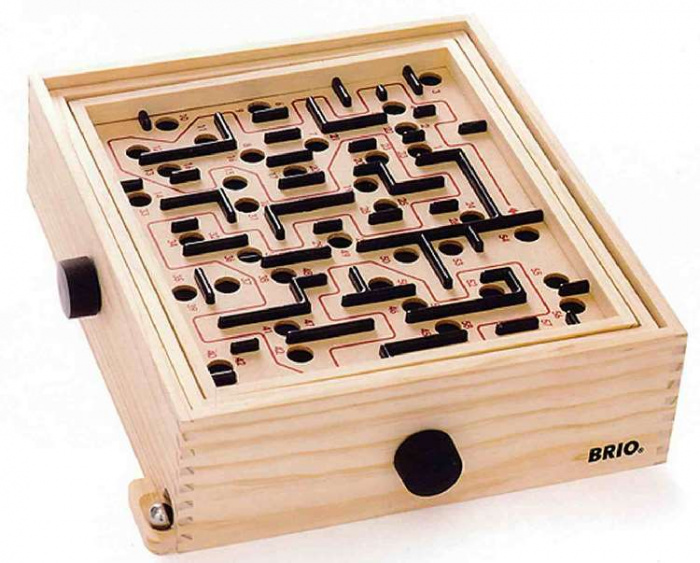

layout: true
class: middle, inverse

--

# Fail Forward: Development of Reproducible and Reusable software is a learning experience

## Bjørn Lindi and [Radovan Bast](http://bast.fr)

### [NeIC](https://neic.nordforsk.org)/ [NTNU](https://www.ntnu.no) / [UiT The Arctic University of Norway](https://uit.no)

Text is free to share and remix under [CC-BY-4.0](https://creativecommons.org/licenses/by/4.0/).

Code examples: [MIT license](http://opensource.org/licenses/mit-license.html)

Credits: [Jonas Juselius](https://github.com/juselius),
[Roberto Di Remigio](http://totaltrash.xyz),
[Ole Martin Bjørndalen](https://github.com/olemb)

---
# Fail forward?

--
## Give yourself the freedom to make mistakes

???
Short feedback cycles. This high addictive game has a short feedback cycle. This how our development evironment should be. But there must be many feedback cycles, and at many levels. This essential for our learning exeperience.
--
# Reproducibility
##[Doubt about 150 published chemistry studies](https://arstechnica.com/information-technology/2019/10/chemists-discover-cross-platform-python-scripts-not-so-cross-platform/)

???
WRF - support example:
- "It work a month a go". Is something changed? I don't think I have large-file-support
- 4-6 weeks to sort out what the problem really was (could have done much faster if one of us were more WRF-fluent)

--
# Reusable

## The bush vs the three

???

- Witness development cycles like a bush not as a three.
- A cycle is a PhD-thesis.
- Loss of our most precious resource - time
- Someone comes after us - could be our future self
